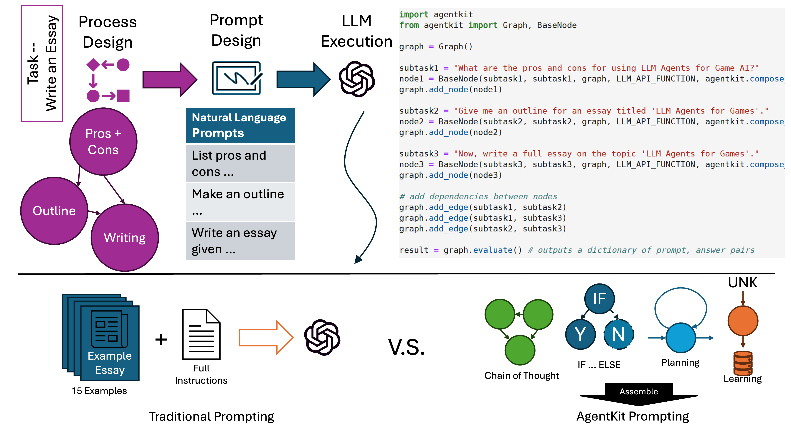

<div align="center">


**AgentKit: Structured LLM Reasoning with Dynamic Graphs**

<!-- [[Website]](https://TODO.org) -->
[[Arxiv Paper]](TODO)
[[PDF]](TODO)
[[Docs]](https://agentkit.readthedocs.io/)

[](https://pypi.org/project/AgentKit-llm/)
[](https://pypi.org/project/agentkit-llm/)
[](https://pepy.tech/project/AgentKit-llm)
[](http://docs.minedojo.org/index.html "Docs")
[](https://github.com/holmeswww/AgentKit/blob/main/LICENSE)
______________________________________________________________________

</div>

 offers a unified framework for explicitly constructing a complex human "thought process" from simple natural language prompts.
The user puts together chains of *nodes*, like stacking LEGO pieces. The chains of nodes can be designed to explicitly enforce a naturally *structured* "thought process".

Different arrangements of nodes could represent different functionalities, allowing the user to integrate various functionalities to build multifunctional agents.

A basic agent could be implemented as simple as a list of prompts for the subtasks and therefore could be designed and tuned by someone *without any programming experience*.


# Contents

- [Installation](#Installation)
- [Getting Started](#Getting-Started)
- [Node Components](#Node-Components)
- [Using AgentKit without Programming Experience](#Using-AgentKit-without-Programming-Experience)
- [Citing AgnetKit](#Citing-AgentKit)

# Installation

<!-- Installing the AgentKit stable version is as simple as:

```bash
pip install agentkit
``` -->


To install the cutting edge version from the main branch of this repo, run:

```bash
git clone https://github.com/holmeswww/AgentKit && cd AgentKit
pip install -e .
```

# Getting Started

The basic building block in AgentKit is a node, containing a natural language prompt for a specific subtask. The nodes are linked together by the dependency specifications, which specify the order of evaluation. Different arrangements of nodes can represent different different logic and throught processes.

At inference time, AgentKit evaluates all nodes in specified order as a directed acyclic graph (DAG).

```python
from agentkit import Graph, BaseNode

graph = Graph()

subtask1 = "What are the pros and cons for using LLM Agents for Game AI?" 
node1 = BaseNode(subtask1, subtask1, graph, LLM_API_FUNCTION)
graph.add_node(node1)

subtask2 = "Give me an outline for an essay titled 'LLM Agents for Games'." 
node2 = BaseNode(subtask2, subtask2, graph, LLM_API_FUNCTION)
graph.add_node(node2)

subtask3 = "Now, write a full essay on the topic 'LLM Agents for Games'."
node3 = BaseNode(subtask3, subtask3, graph, LLM_API_FUNCTION)
graph.add_node(node3)


graph.add_edge(subtask1, subtask2)
graph.add_edge(subtask1, subtask3)
graph.add_edge(subtask2, subtask3)

result = graph.evaluate() # outputs a dictionary of prompt, answer pairs
```

``LLM_API_FUNCTION`` can be any LLM querying function that takes ``msg:list`` and ``shrink_idx:int``, and outputs ``llm_result:str`` and ``usage:dict``. Where ``msg`` is a prompt ([OpenAI format](https://platform.openai.com/docs/guides/text-generation/chat-completions-api) by default), and ``shrink_idx:int`` is an index at which the LLM should reduce the length of the prompt in case of overflow. 

AgentKit tracks token usage of each node through the ``LLM_API_FUNCTION`` with:
```python
usage = {
    'prompt': $prompt token counts,
    'completion': $completion token counts,
}
```

# Using AgentKit without Programming Experience
First, follow [the installation guide](#Installation) to install AgentKit.


# Node Components


Inside each node (as shown to the left of the figure), AgentKit runs a built-in flow that **preprocesses** the input (Compose), queryies the LLM with a preprocessed input and prompt $q_v$, and optionally **postprocesses** the output of the LLM (After-query).

To support advanced capabilities such as branching, AgentKit offers API to dynamically modify the DAG at inference time (as shown to the right of the figure). Nodes/edges could be dynamically added or removed based on the LLM response at some ancestor nodes.

# Citing AgentKit
```bibtex
TBD
```
